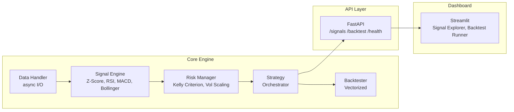

# Trading Signal Engine

[](https://github.com/Pramurta/Trading-Signal-Engine/actions/workflows/ci.yml)
[](https://www.python.org/downloads/)
[](LICENSE)

A production-ready Python framework for real-time market data processing, statistical signal generation, and risk-managed trading strategy development.

## Architecture



## Features

- **Asynchronous data processing** — concurrent market data fetching via asyncio
- **Statistical signals** — Z-Score, RSI, Bollinger Bands, MACD with configurable weights
- **Risk management** — Kelly Criterion, volatility scaling, max drawdown controls
- **Vectorized backtesting** — NumPy-based engine for fast historical simulation
- **REST API** — FastAPI backend with auto-generated Swagger docs at `/docs`
- **Interactive dashboard** — Streamlit UI with Plotly charts
- **Containerized** — Docker Compose for local dev, Render.com for cloud deployment

## Quick Start

### Local Development

```bash
# Clone and install
git clone https://github.com/Pramurta/Trading-Signal-Engine.git
cd Trading-Signal-Engine
python -m venv .venv && source .venv/bin/activate  # Windows: .venv\Scripts\activate
pip install -r requirements.txt

# Run API
uvicorn api.main:app --reload

# Run dashboard (in another terminal)
streamlit run dashboard/app.py
```

### Docker

```bash
docker compose up --build
```

- API: http://localhost:8000
- Dashboard: http://localhost:8501
- API Docs: http://localhost:8000/docs

### Run Backtest Demo

```bash
python run_backtest.py
```

## API Endpoints

| Method | Path | Description |
|--------|------|-------------|
| `GET` | `/health` | Health check |
| `POST` | `/signals/generate` | Generate signals for given symbols |
| `POST` | `/backtest/run` | Run backtest with performance metrics |
| `GET` | `/backtest/report/{id}` | Retrieve cached backtest result |

## Testing

```bash
# Run all tests
python -m pytest src/tests/ api/tests/ -v

# Run with coverage
python -m pytest --cov=src --cov-fail-under=80

# Lint and format
ruff check . && ruff format --check .

# Type check
mypy src/ api/
```

## License

[MIT](LICENSE)
