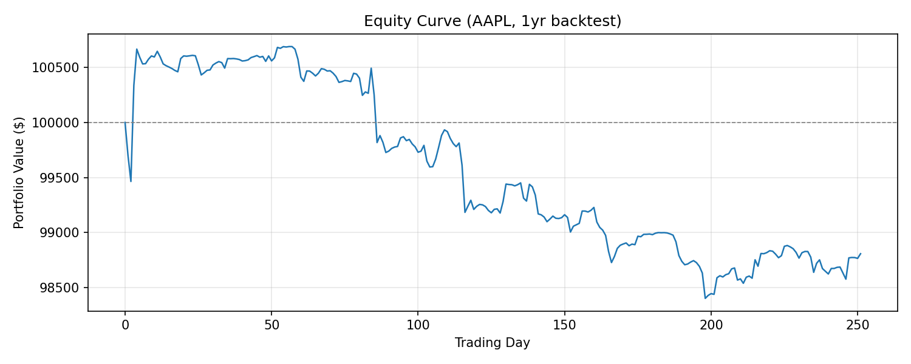

# Trading Signal Engine

I built this to learn how signal-driven backtesting works end-to-end. It fetches market data (real via yfinance or synthetic), computes technical indicators, combines them into trading signals, sizes positions with risk controls, and backtests the result. It's a learning project, not a trading system.

## Stack

- Python 3.11+
- NumPy, pandas — signal math and data handling
- yfinance — real market data
- FastAPI — REST API wrapper
- Streamlit — dashboard UI
- pytest — tests

## How to run

```bash
# Setup
python -m venv .venv && source .venv/bin/activate  # Windows: .venv\Scripts\activate
pip install -r requirements.txt

# Run the demo (synthetic data, no internet needed)
python run_backtest.py

# Run the real-data example (needs internet)
python examples/run_example.py

# Run tests
python -m pytest src/tests/ api/tests/ -v

# Start the API
uvicorn api.main:app --reload

# Start the dashboard (needs API running)
streamlit run dashboard/app.py
```

## What's inside

**`src/data_handler.py`** — Async data fetcher. Generates synthetic OHLCV via Geometric Brownian Motion, or pulls real data from Yahoo Finance through a thread pool.

**`src/signals.py`** — Computes Z-Score, RSI, Bollinger %B, and MACD. Each returns a normalized signal in [-1, 1]. Signals are combined via weighted average.

**`src/risk_manager.py`** — Position sizing using Kelly Criterion (quarter-Kelly by default), inverse volatility scaling, and drawdown-based risk reduction.

**`src/strategy.py`** — Orchestrator that ties data + signals + risk together and produces trade decisions.

**`src/backtest.py`** — Vectorized backtester. Takes (T x N) price/signal matrices, models transaction costs and slippage, computes Sharpe, Sortino, drawdown, etc. Also has walk-forward analysis and parameter sweep.

**`api/`** — FastAPI endpoints: `POST /signals/generate`, `POST /backtest/run`, `GET /backtest/report/{id}`, `GET /health`.

**`dashboard/`** — Streamlit app with a signal explorer and backtest runner. Talks to the API via httpx.

## Example output

This is real output from `examples/run_example.py` — 1 year of AAPL data pulled from Yahoo Finance on 2025-04-08:

```
AAPL: 252 days, $253.50, vol=28.8%, return=+35.2%

Backtest: 252 days, $100,000
Final equity: $98,808

Total Return:         -1.19%
CAGR:                 -1.19%
Sharpe Ratio:          -4.06
Sortino Ratio:         -5.34
Max Drawdown:          2.27%
Max DD Duration:         195 days
Volatility:            1.53%
Win Rate:              48.5%
Profit Factor:          0.60
Trades:                   33
```



The strategy lost money while AAPL was up 35%. That's what happens when you run mean-reversion signals on a trending stock — the signals keep fading the move. This is expected and honest.

## Known limitations

- **No slippage model beyond a flat basis-point estimate.** Real slippage depends on order size, spread, and market impact.
- **No survivorship bias correction.** The symbol list is hand-picked.
- **Signal weights are hand-tuned, not learned.** The 35/25/25/15 split was chosen by feel, not optimized out-of-sample.
- **Mean-reversion signals fight trending markets.** The strategy will underperform in strong trends (as shown above). A real system would need regime detection.
- **The async pattern is mostly cosmetic for synthetic data** — it just awaits a sleep. It's real for yfinance (blocking calls go through a thread pool), but it's not a latency-sensitive streaming system.

## License

[MIT](LICENSE)
